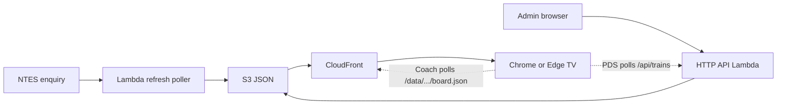

# 01 — Executive Summary

## What this project is

**Railway PDS** is a serverless passenger information suite for Indian Railway stations. It delivers two complementary screen products from one monorepo and a shared live-data pipeline:

1. **PDS (Passenger Display System)** — a classic multi-row arrivals/departures board for platforms and concourses.
2. **Coach Position** — a large-TV coach-order (rake) view with a “You are here” traveller pin and walk guidance.

Both products consume **NTES Live Station** data (trains that halt at the station) and are designed to run on ordinary **Chrome or Edge** browsers on Android/Windows TVs — **without a PC at the station**.

## Why it exists

Station staff and passengers need reliable, language-aware platform information that stays current without manual whiteboard updates or proprietary on-premise servers. This suite turns official railway enquiry data into branded, readable displays that operations can switch by station and manage remotely.

## Target users

| Persona | Use |
|---------|-----|
| Passengers | Read train times, platforms, coach order, Divyangjan positions |
| Station ops / contractors | Change station, override platforms, stop misbehaving screens |
| Zasya delivery / support | Deploy, refresh caches, monitor health |

## Business domain

Indian Railways **passenger information displays** (PIS/PDS) at stations — starting from Charlapalli (CHZ) and Bhongir (BG) pilots, designed to scale to many stations and screens.

## Key value proposition

- **No station server** — TVs load HTTPS pages from CloudFront; data is JSON from the CDN.
- **One NTES poll per station**, not per TV — keeps AWS cost low at fleet scale.
- **Bilingual/trilingual UI** — English → Telugu → Hindi rotation on chrome and labels.
- **Remote session control** — admin can list and blank active display tabs.
- **Per-device commercial model** — PDS and Coach on the same physical screen bill once ([rate card](../coach-position/RATE_CARD.md)).

## Major capabilities

| Capability | PDS | Coach Position |
|------------|-----|----------------|
| Live NTES board | Yes | Yes (halts + coach composition) |
| EN/TE/HI UI | Yes | Yes |
| Admin station switch | Yes | Yes (per-station displays config) |
| Platform overrides | Yes | N/A (uses NTES PF + display pin) |
| Viewer session stop | Yes | Local API; limited on static CF |
| Chart (NTES-style) view | No | Yes (`/chart.html`) |
| Premium TV presentation | No | Yes (`/premium.html`) |
| Cross-platform FOB guidance | N/A | Yes (BG entrance TV → PF2/PF3 via PF1 FOB) |
| Multi-station URL | Config-driven | `?station=` + `?display=` |

## High-level technical approach

- **AWS region:** `ap-south-1` (ACM certificates for CloudFront in `us-east-1`).
- **Runtime:** Node.js 22, Express for local demo, Lambda + API Gateway + S3 + CloudFront + EventBridge in production.
- **Persistence:** JSON objects in S3 (and local `data/` files) — **no relational database**.

## Document pack

This document is part of the [as-built documentation pack](./README.md).
