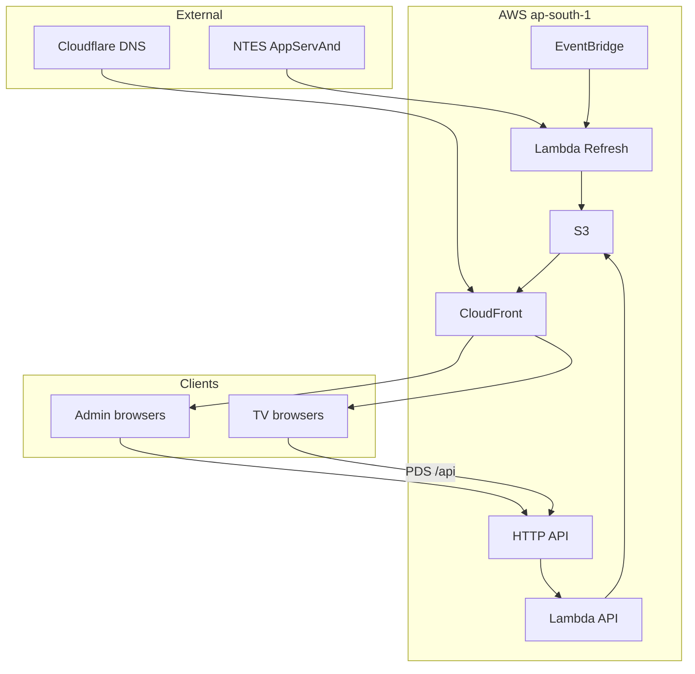

# 04 — Solution Overview

## Approach

Deliver two browser-based display products backed by a **serverless AWS** stack and the Indian Railways **NTES** enquiry endpoint. Local Express servers exist for development only.

## Major modules

| Module | Location | Responsibility |
|--------|----------|----------------|
| PDS display UI | `public/` | Poll `/api/trains`, page rows, rotate languages |
| PDS admin UI | `public/admin.html` | Sessions, station, PF overrides, refresh control |
| Coach TV / Premium / Chart UI | `coach-position/public/` | Poll board JSON, feature rake, pin/walk; three themes |
| Coach admin UI | `coach-position/public/admin.html` | Displays config, station search/save |
| Shared NTES client | `services/ntesClient.js` | Encrypted AppServAnd calls |
| PDS merge/board | `services/railwayService.js`, `mergeService.js` | Live board → display list |
| Coach window/board | `coach-position/services/*` | Visibility window, rake payload |
| API Lambda | `lambda/api.js` | PDS + Coach admin/board routes |
| Refresh Lambda | `lambda/refresh.js` + `coachRefresh.js` | NTES → S3 |

## Key workflows

1. **Cloud poller** — EventBridge (~1 min) → refresh Lambda → NTES → write `live_status.json` (PDS) and `stations/{CODE}/board.json` (Coach).
2. **PDS TV** — Browser polls `/api/trains` every ~30s via CloudFront → API Gateway → Lambda.
3. **Coach TV** — Browser polls `/data/stations/{CODE}/board.json` every ~15s from CloudFront (no Lambda on the TV path). Presentation: Current TV `/`, Premium `/premium.html`, or Chart `/chart.html`.
4. **Admin** — Shared admin key; Search/Save/stop via API.
5. **UI publish** — After HTML/CSS/JS changes, operators run `coach-position/scripts/publish-ui.sh` (S3 sync + CloudFront invalidation). Git push alone does not update the live Coach site.

## User journeys

### Passenger (TV)

1. TV opens branded HTTPS URL.
2. Board auto-refreshes; language rotates EN → TE → HI.
3. Coach view shows featured train rake + pin when configured.

### Operator (admin)

1. Opens admin page, enters admin key.
2. Changes station / display / PF override as needed.
3. Stops a session if a screen is stuck or unauthorized.

## System boundaries

## External integrations

| System | Use |
|--------|-----|
| NTES (`enquiry.indianrail.gov.in`) | Live station board, station name lookup |
| Cloudflare DNS | CNAME to CloudFront |
| AWS ACM / CloudFront / S3 / Lambda / API Gateway / EventBridge | Hosting |

See [18 — Integrations](./18-integrations.md).
