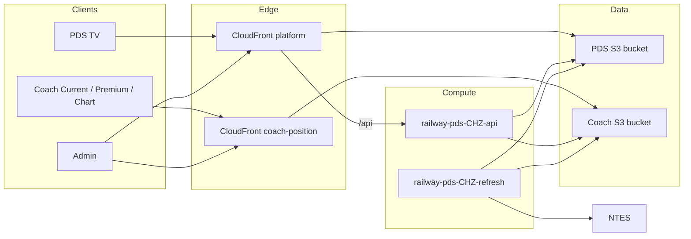
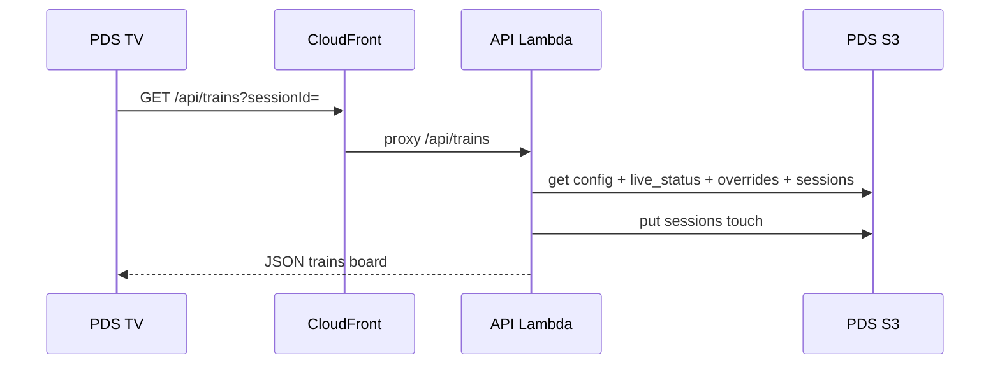
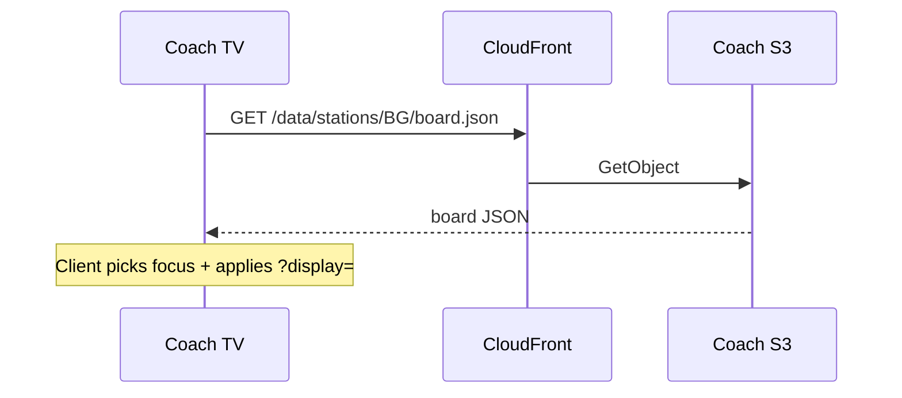
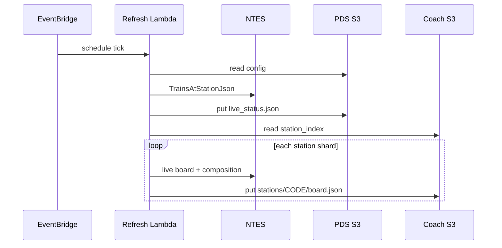

# 05 — System Architecture

## Overview

The system is a **serverless dual-product** architecture: two static frontends, one shared NTES integration, S3 JSON as the system of record for display state, and Lambda functions for API and scheduled refresh.

There is **no** relational database, Redis cache, message queue, WebSocket tier, or multi-tenant SaaS control plane in the as-built codebase.

## High-level architecture

See also: [diagrams/01-high-level-architecture.md](./diagrams/01-high-level-architecture.md)

## Frontend architecture

| App | Stack | Delivery |
|-----|-------|----------|
| PDS | Vanilla JS, CSS, HTML | S3 → CloudFront |
| Coach | Vanilla JS, CSS, HTML (Current TV + Premium + Chart themes) | S3 → CloudFront |

No React/Vue/Angular. Config via `public/config.js` / `coach-position/public/config.js`.

Details: [12 — Frontend Architecture](./12-frontend-architecture.md).

## Backend architecture

| Mode | Entrypoint | Role |
|------|------------|------|
| Production API | `lambda/api.js` | HTTP API (API Gateway) |
| Production poller | `lambda/refresh.js` + `lambda/coachRefresh.js` | EventBridge schedule |
| Local PDS | `server.js` + `routes/api.js` | Express `:3000` |
| Local Coach | `coach-position/server.js` + `routes/api.js` | Express `:3001` |

Dedicated Coach Lambda template exists under `coach-position/infra/` but **production Coach Save/poller is option B** (PDS Lambdas). See [13 — Backend Architecture](./13-backend-architecture.md).

## API layer

- **PDS:** CloudFront path `/api/*` → HTTP API → `railway-pds-CHZ-api`.
- **Coach TVs:** no `/api` on CloudFront; static JSON only.
- **Coach Admin Save:** direct HTTP API host (`LOOKUP_BASE` / execute-api URL) for `/api/coach/*` and `/api/station-lookup`.

## Data layer (not SQL)

JSON documents in S3 / local `data/`. See [09 — Database Documentation](./09-database-documentation.md).

## Authentication layer

Shared string admin keys (`ADMIN_KEY`, `COACH_ADMIN_KEY`). Viewer sessions via `X-Session-Id`. No JWT/OAuth/MFA. See [11 — Authentication](./11-authentication-authorization.md).

## Cache layer

| Cache | Mechanism |
|-------|-----------|
| CloudFront static assets | Long-cache images; UI cache-bust query `?v=` |
| Coach board JSON | Recommended short TTL (~30–60s) on put |
| Browser | `cache: 'no-store'` on live fetches |
| Lambda in-memory | None significant |

## Queue / background jobs

| Job | Trigger | Handler |
|-----|---------|---------|
| NTES refresh | EventBridge `rate(1 minute)` | `railway-pds-CHZ-refresh` |
| Coach cache backup | GitHub Actions cron `*/5` | `publish-live-cache.sh` |

No SQS/Bull/Redis workers.

## WebSockets / events

**Not implemented.** Polling only.

## File storage & CDN

| Store | Content |
|-------|---------|
| PDS S3 | `public/` site + `data/*.json` |
| Coach S3 `railway-coach-position-site-884000107109` | Site + per-station JSON |
| CloudFront | OAC to private S3; HTTPS custom domains |

## Offline sync

**Not implemented.** Displays require network to CloudFront/API. Client re-picks Coach focus from wall clock vs cached `stationBoard` so a slightly stale cache still drops departed trains.

## Multi-tenant / mobile

| Concern | Status |
|---------|--------|
| Multi-tenant SaaS | N/A — station codes / display IDs only |
| Mobile apps | N/A — browser TVs only |

## Request lifecycles

### PDS TV poll

### Coach TV poll

### Refresh poller

## Deployment topology

Documented resources (from repo READMEs / INFRA):

| Resource | ID / name |
|----------|-----------|
| Region | `ap-south-1` |
| Stack | `railway-pds-chz` |
| PDS CF | `EVTX6GW0ROE2O` |
| Coach CF | `E12U4PGOD25ISI` |
| HTTP API | `2j7ifmjjyb` |
| API Lambda | `railway-pds-CHZ-api` |
| Refresh Lambda | `railway-pds-CHZ-refresh` |
| EventBridge | `railway-pds-CHZ-refresh-schedule` |

Full diagram: [diagrams/02-deployment-topology.md](./diagrams/02-deployment-topology.md).
