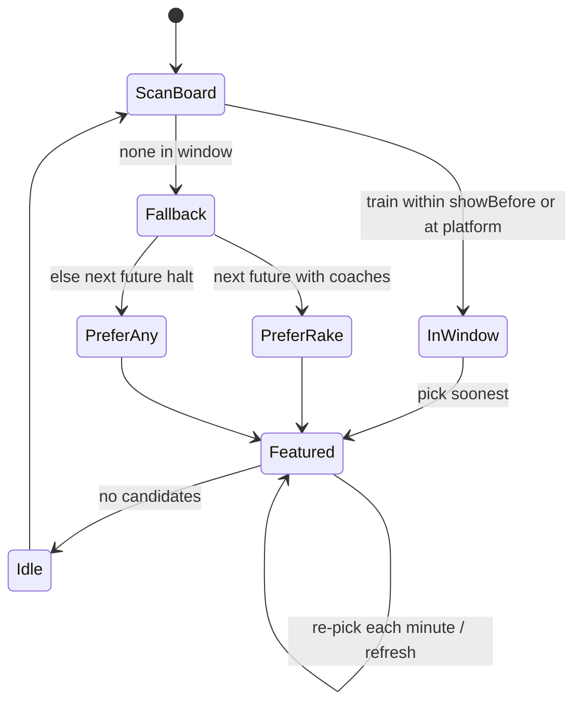

# 06 — Business Logic

Rules below are inferred from **implementation** (services, config JSON, client JS). Where docs disagree with code, **code wins**.

## PDS board visibility

| Rule | Source | Behaviour |
|------|--------|-----------|
| Lookahead | `config.lookAheadHours` (default 4) | NTES hours window |
| Hide departed | `hideDepartedAfterMinutes` (default **15** in PDS `config.json`) | After departure + grace, drop from display list |
| Display pool | `displayCount` | Cap eligible trains |
| Page size | `pageSize` (6) | Rows per page |
| Page interval | `pageIntervalSeconds` (10) | Page / language rotation cadence |
| Languages | `languages: [en, te, hi]` | Full chrome rotation |

Merge/filter: `services/mergeService.js` + `railwayService.js`.

## Coach visibility window

| Rule | Source | Behaviour |
|------|--------|-----------|
| Show before | `showBeforeMinutes` default **10** | Prefer trains within T−10 of arrival/dep |
| Hide after depart | `hideAfterDepartMinutes` default **0** (live data) | **Departed = gone** |
| Focus pick | `windowService.js` / client `pickLiveFocus` | Prefer in-window; else next future halt |
| Prefer rake | Client + builder | If fallback train has empty composition, prefer next halt **with** coaches |
| Halts only | `liveBoardService.js` | Pass-through trains do not appear on NTES TrainsAtStation |

> Note: `docs/coach-position/MODEL.md` may still mention hide-after default 15; **as-built live Coach data uses 0**.

### Focus state machine (Coach)

## You-are-here / walk (Coach)

- Pin from display `youAreHere` (`platform`, `metresFromEngineEnd` / `slotIndex`, `facing`).
- Client resolves pin against the featured train’s platform (`samePlatform`).
- Walk metrics from bogie length (default 25 m) and walk speed (~0.65 m/s): distance = |coachSlot − pinSlot| × bogie.
- **Frozen UI rule (all themes):** walk distance/time labels sit on the **platform side** of the yellow line; left of pin `rotate(-90deg)`, right of pin `rotate(90deg)`; meters then “walk …” time. Canonical CSS block in `style.css`; Cursor rule `coach-position/.cursor/rules/premium-platform-walk-freeze.mdc`.

## Cross-platform wayfinding (BG entrance-main)

As-built for main-entrance TVs on **Platform 1** (`configuredPlatform: "1"`), when the featured train is on **PF2 or PF3**:

| Concern | Behaviour |
|---------|-----------|
| Coach rake | Still shows the **train’s** composition (what passengers board after crossing) |
| Amenities strip | **Platform 1** amenities only (toilet, waiting, Station Master, drinking water) — do not switch to PF2 strip |
| You-are-here | PF1 entrance pin (slot ~7 / 167 m) remains the origin |
| Walk labels under coaches | Same pin math and ±90° placement as for a PF1 train |
| FOB graphic | Anchored to **fixed PF1 survey markers** (~14–15) via `amenityPctOnRake` — **not** placed at pin + 178 m on the rake |
| Banner / wayfind copy | Still says walk **178 m** (`walkMetersFromDisplayPin` on `fob-pf1`) to the FOB, then cross to train platform |
| PF1 same-platform trains | Unchanged — FOB may use pin-relative `fobAnchorPct` for same-side layout |

Layout evidence: `coach-position/data/stations/BG/layout.json` (`fob-pf1.linksToPlatforms: ["2","3"]`). Client: `crossPlatformFobContext`, `fobBridgeOverlayHtml`, `deckPin` in `public/js/app.js`.

See workflow: [workflows/coach-cross-platform-wayfinding.md](./workflows/coach-cross-platform-wayfinding.md).

## Station & display identity (Coach)

- URL: `?station={CODE}&display={id}` (defaults `BG`, `entrance-main`).
- Per-station config: `data/stations/{CODE}/displays.json`.
- Per-station layout / amenities: `data/stations/{CODE}/layout.json`.
- Poller roster: `data/station_index.json`.

## Platform overrides (PDS only)

- Stored in `data/platform_overrides.json`.
- Applied over NTES platform when building display list.
- Stale train numbers pruned when serving board/admin APIs.
- Overridden PF badges highlighted on UI.

## Sessions

- Heartbeat on each board poll with `sessionId`.
- Stale after **90 seconds**; pruned after **24 hours**.
- Admin stop sets `killedAt` → next poll returns **409** `session_stopped`.

## Language / i18n

- Dictionaries in `public/js/i18n.js` and `coach-position/public/js/i18n.js`.
- Station names from curated `stations.json` masters where present.
- Train names remain NTES English (as implemented).

## Billing / inventory / approvals

**Not implemented** in code. Commercial guidance only in RATE_CARD.

## Sync / retry

| Path | Behaviour |
|------|-----------|
| Coach TV | If live API unavailable, fall through to static board JSON |
| Refresh Lambda | Per-station errors logged; other stations continue |
| NTES failure | API returns 502/503 with error payload |

## Validation rules (selected)

| Action | Validation |
|--------|------------|
| Station code | Trim, uppercase, length ≥ 2; NTES resolve required for apply/save |
| Display id | Required on create/update; normalized lowercase |
| Admin | Matching `ADMIN_KEY` / `COACH_ADMIN_KEY` |
| Session stop | `sessionId` required |
