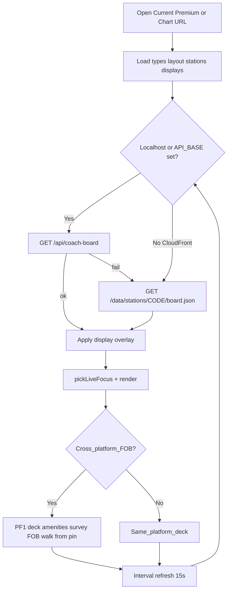
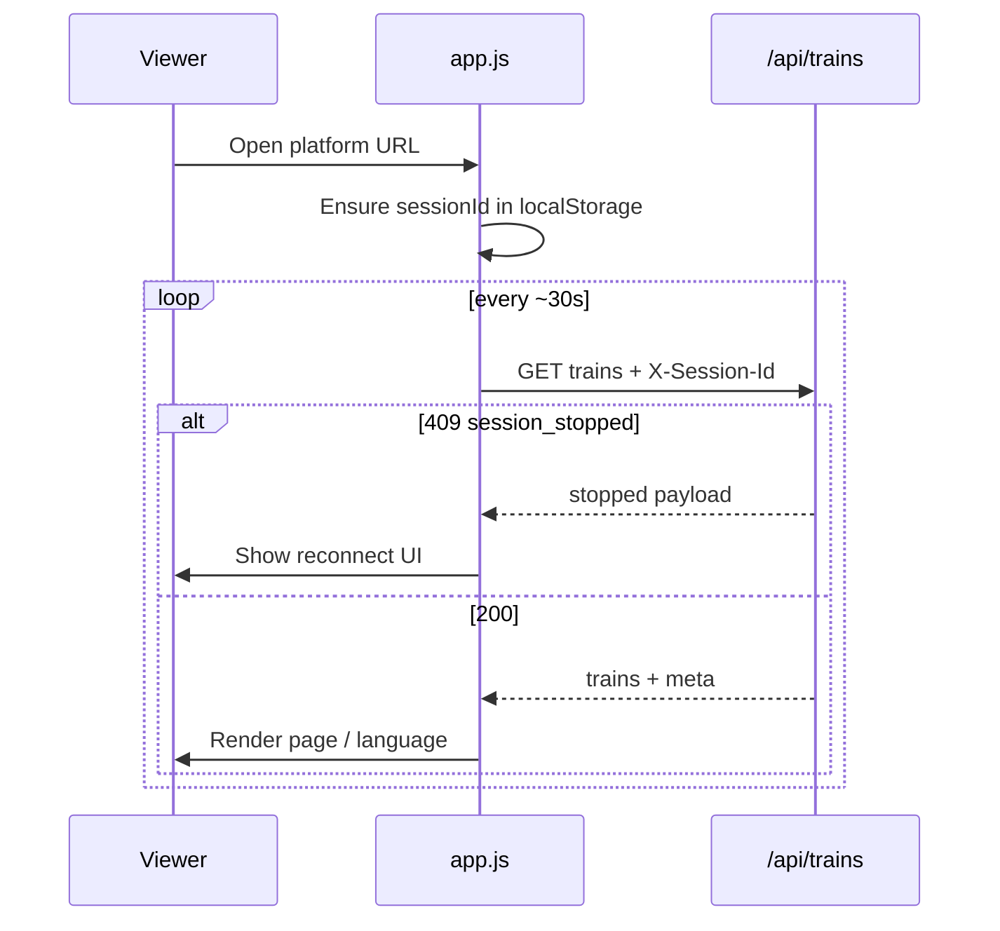
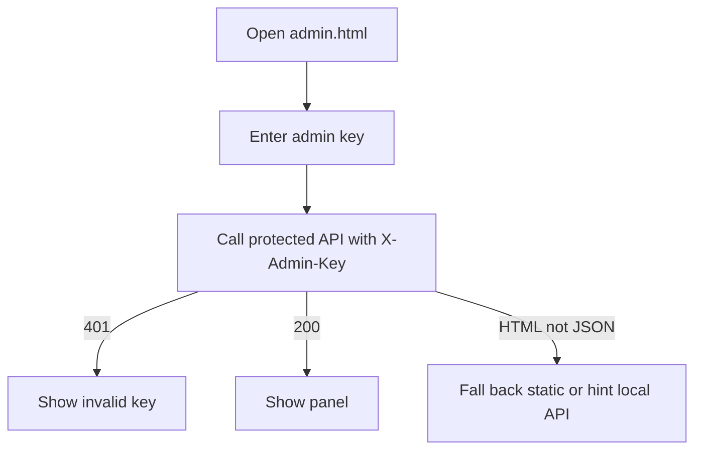
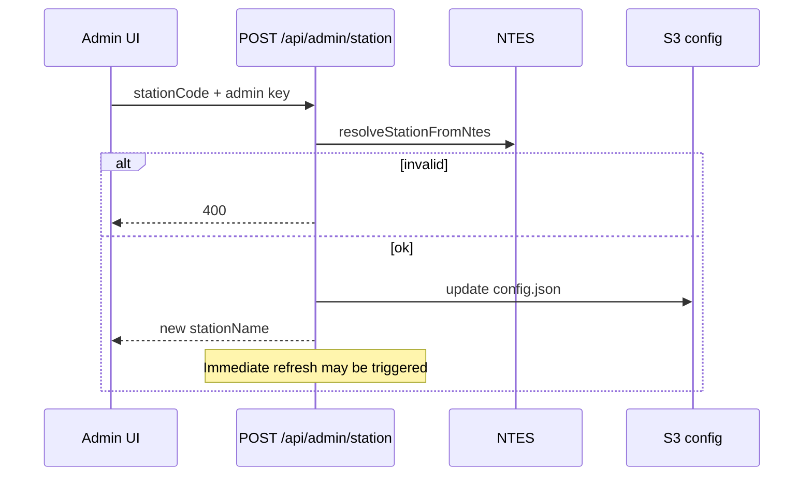
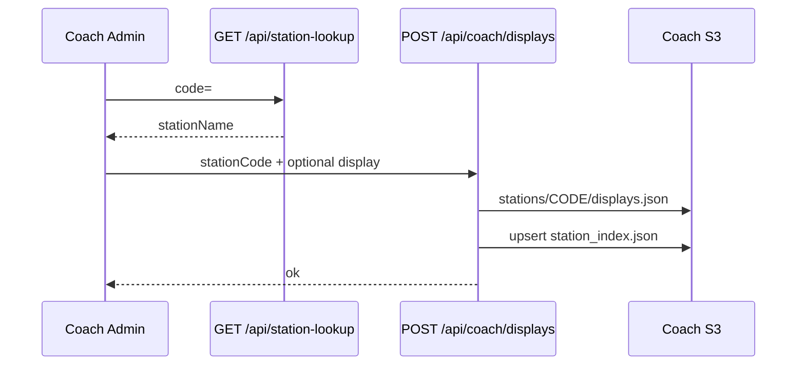
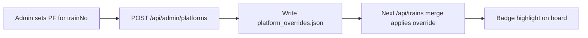
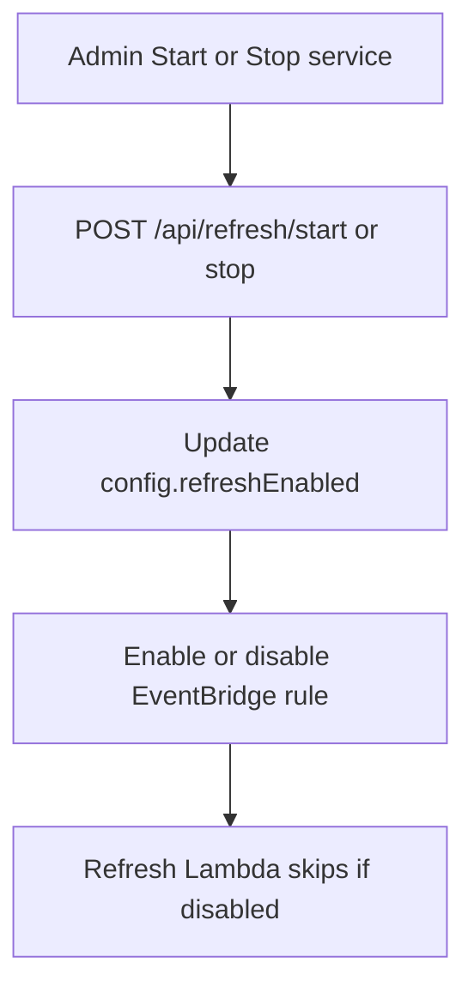
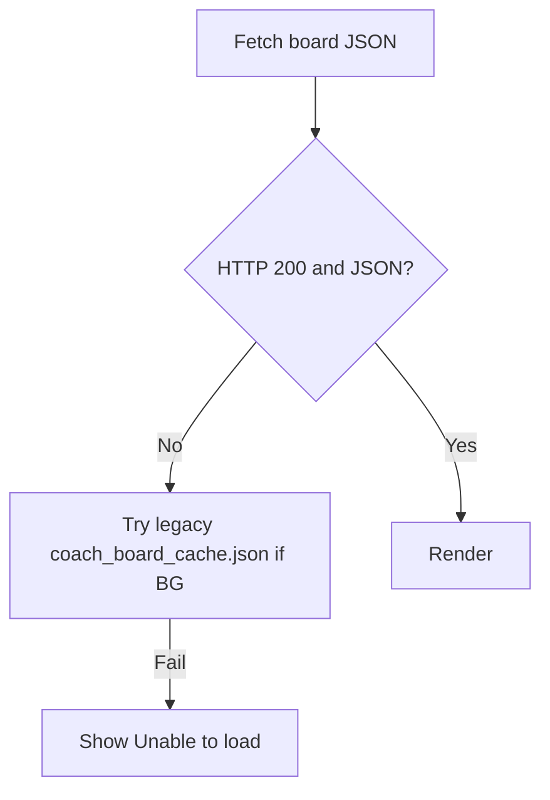

# 07 — Process Flows

## Coach TV load

Related: [workflows/coach-cross-platform-wayfinding.md](./workflows/coach-cross-platform-wayfinding.md)

## PDS TV load

## Admin unlock (shared pattern)

## PDS apply station

## Coach save station / display

## Platform override (PDS)

## Refresh enable / disable (PDS)

## Error / retry (Coach static path)

## Flows not present

Registration, OAuth login, payments, order lifecycle, multi-step approvals — **Could not infer / not implemented**.
