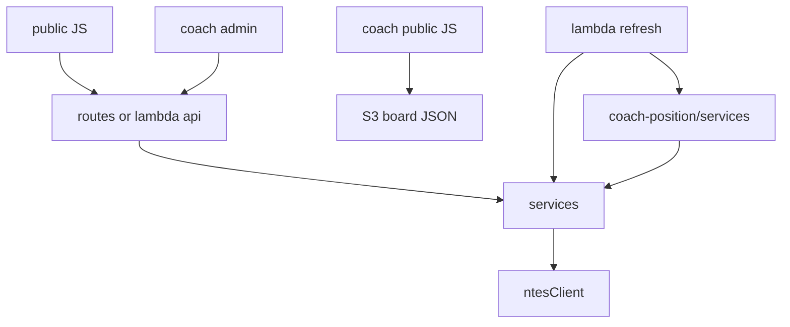

# 08 — Module Breakdown

## Monorepo layout

```
railway-pds/
├── public/                 # PDS UI
├── routes/                 # PDS Express API
├── services/               # Shared NTES + PDS domain
├── data/                   # PDS JSON state
├── lambda/                 # Production API + refresh (+ coach poller)
├── infra/                  # CloudFormation + IAM JSON
├── scripts/                # Deploy / build / cert
├── server.js               # PDS local entry
├── coach-position/         # Coach product
│   ├── public/
│   ├── routes/
│   ├── services/
│   ├── data/
│   ├── lambda/             # Alternate dedicated handlers
│   ├── infra/
│   └── scripts/
└── docs/                   # Product + as-built docs
```

## Module dependency (simplified)



## Root modules

| Module | Path | Responsibility |
|--------|------|----------------|
| Express server | `server.js` | Local PDS host |
| API router | `routes/api.js` | Local HTTP routes |
| NTES client | `services/ntesClient.js` | External enquiry |
| NTES crypto | `services/ntesCrypto.js` | Protocol encryption |
| Railway map | `services/railwayService.js` | NTES → PDS trains |
| Merge | `services/mergeService.js` | Display list rules |
| Sessions | `services/sessionService.js` | Viewer session store |
| Station catalog | `services/stationCatalog.js` | Presets / locales |
| Platform overrides | `services/platformOverrides.js` | Manual PF |
| Lambda API | `lambda/api.js` | Production API |
| Lambda refresh | `lambda/refresh.js` | PDS + coach poll |
| Coach refresh glue | `lambda/coachRefresh.js` | Multi-station coach boards |
| S3 helper | `lambda/lib/s3.js` | Get/Put JSON |
| Scheduler helper | `lambda/lib/scheduler.js` | Enable/disable EventBridge |

## Coach modules

| Module | Path | Responsibility |
|--------|------|----------------|
| Express server | `coach-position/server.js` | Local Coach host |
| API router | `coach-position/routes/api.js` | Local coach APIs |
| Live board | `services/liveBoardService.js` | NTES → coach trains |
| Board builder | `services/boardBuilder.js` | API payload |
| Window | `services/windowService.js` | T−10 / focus |
| Mapper | `services/coachMapper.js` | Codes → types, pin |
| Heading | `services/headingService.js` | Travel direction |
| Station store | `services/stationStore.js` | Paths / overlays |
| Composition | `services/compositionService.js` | Optional composition fetch |
| Publish scripts | `scripts/publish-*.sh` | S3 sync + invalidate |

## Feature ↔ module map

| Feature | Modules |
|---------|---------|
| Live arrivals board | railwayService, mergeService, public/js/app.js |
| Language rotation | i18n.js + config intervals |
| Session stop | sessionService + admin.js |
| Station switch | stationCatalog + ntesClient + admin |
| Coach rake TV | boardBuilder, windowService, app.js |
| Coach Current / Premium / Chart themes | index.html, premium.html, chart.html + theme CSS |
| Coach cross-platform FOB (BG) | layout.json + app.js (`crossPlatformFobContext`, `fobBridgeOverlayHtml`) |
| Per-station Coach | stationStore, coachRefresh |
| Rate card (docs only) | docs/coach-position/RATE_CARD.md |
