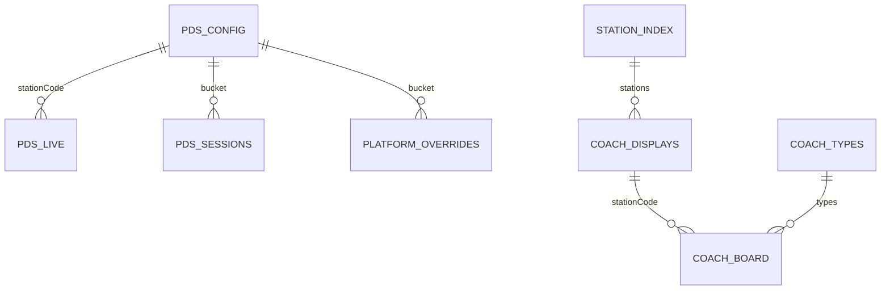

# 09 — Database / Data Store Documentation

## Overview

**There is no relational database, ORM, or migration framework** in this project.

Persistence is **JSON files**:

- Locally: filesystem under `data/` and `coach-position/data/`
- Production: **Amazon S3** objects (same logical keys under `data/`)

Treat this section as the **data model / document store** documentation.

## Storage strategy

| Concern | Approach |
|---------|----------|
| Primary store | S3 JSON |
| Multi-tenant | N/A — keys namespaced by station code |
| Soft delete | N/A — objects overwritten; sessions pruned |
| Audit fields | `generatedAt`, `liveFetchedAt`, `lastUpdated`, session timestamps |
| Migrations | Manual key renames / dual-write legacy aliases |

## ER-style document model

See [erd/json-data-model.md](./erd/json-data-model.md).



## PDS documents

### `data/config.json`

| Field | Type | Purpose |
|-------|------|---------|
| stationCode | string | Active station |
| stationName | string | Display name |
| refreshInterval | number | Seconds (UI/meta) |
| refreshEnabled | boolean | Poller gate |
| platforms | number | Station PF count (meta) |
| displayCount | number | Max trains in pool |
| pageSize | number | Rows per page |
| pageIntervalSeconds | number | Rotation |
| languageRotateSeconds | number | Language cadence |
| languages | string[] | e.g. en, te, hi |
| hideDepartedAfterMinutes | number | Grace after depart |
| lookAheadHours | number | NTES hours |

### `data/live_status.json`

| Field | Purpose |
|-------|---------|
| lastUpdated | ISO timestamp |
| stationCode | Code |
| trains | Array of board train objects |

### `data/platform_overrides.json`

Manual PF overrides keyed by train number (see `platformOverrides.js`).

### `data/sessions.json`

Map of session id → `{ startedAt, lastSeenAt, userAgent, killedAt }`.

### `data/stations.json` / `data/trains.json`

Curated masters for names/presets and train metadata merge.

## Coach documents

### `data/station_index.json`

```json
{ "stations": ["BG"] }
```

Poller roster.

### `data/stations/{CODE}/displays.json`

Station-level Coach config: bogie length, window minutes, languages, `displays[]` with `id`, `mode`, `platformsShown`, `youAreHere`.

### `data/stations/{CODE}/board.json`

Cached board payload: `stationBoard`, `boardRakes`, `focus`, window fields, `generatedAt`, etc.

### `data/stations/{CODE}/layout.json`

Station survey geometry used by the Coach TV client:

| Field | Role |
|-------|------|
| `platforms[]` | Marker spans (`secunderabadMarker` / `kazipetMarker`), island pairing |
| `amenities[]` | Toilet, waiting, SM, water, FOB, display mount — `platform`, `markerFrom`/`markerTo`, `category` |
| Circulation FOB | e.g. BG `fob-pf1`: `walkMetersFromDisplayPin` (banner copy), `linksToPlatforms` (`["2","3"]`) |
| `orientation` / notes | Engine end / survey notes |

Client maps amenities onto the rake when the deck platform matches the display pin side (BG entrance = PF1).

### Legacy aliases (BG)

- `coach_displays.json`
- `coach_board_cache.json`
- `station_layout.json`

### `coach_types.json`

Coach type catalog + `codeRules` mapping NTES codes → type ids / labels.

## Indexes & constraints

| Concept | Implementation |
|---------|----------------|
| Primary key | S3 object key / station code + display id |
| Uniqueness | Display `id` unique within station displays array |
| Foreign keys | Logical only (trainNo ↔ boardRakes) |
| Indexes | None (object get by key) |

## Query patterns

| Pattern | Access |
|---------|--------|
| PDS board serve | Get config + live_status + overrides + sessions |
| Coach TV | GetObject board.json by station |
| Coach save | Put displays.json + upsert index |
| Poller | List stations from index; put board per code |

## Performance considerations

- Prefer CloudFront caching of board JSON over Lambda-per-TV.
- Refresh timeout raised to **300s** for multi-station coach loop; shard with `COACH_SHARD_MOD` when roster grows.
- Keep board JSON compact; gzip at CDN.

## Schemas (documentation)

JSON Schema examples: `docs/coach-position/schemas/`.
