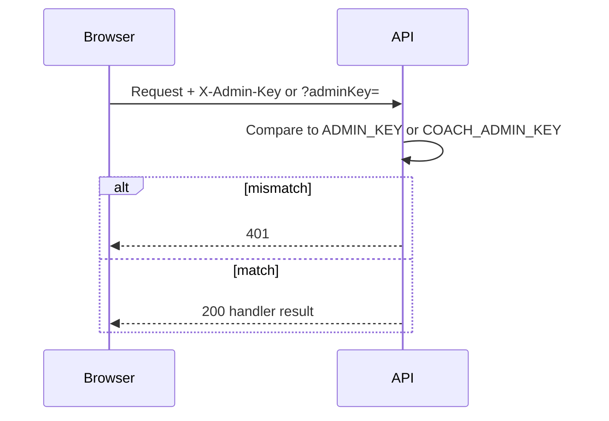

# 11 — Authentication & Authorization

## Strategy summary

| Mechanism | Used? |
|-----------|-------|
| Shared admin API key | **Yes** |
| Viewer session IDs | **Yes** (stop control) |
| JWT / cookies / OAuth / MFA | **No** |
| User accounts / RBAC | **No** |

This is a **display kiosk + ops key** model, not an identity platform.

## Admin authentication

| Scope | Env var | Local fallback (documented) |
|-------|---------|------------------------------|
| PDS admin routes | `ADMIN_KEY` | `chz-ops` |
| Coach routes on PDS Lambda | `COACH_ADMIN_KEY` | `coach-ops` |
| Local Coach Express | `ADMIN_KEY` | `coach-ops` |

**Production:** set strong keys in Lambda environment. Do not commit real secrets.

## Viewer sessions

| Item | Value |
|------|-------|
| Client storage | `localStorage` key (`pds_session_id` / `coach_session_id`) |
| Transport | `X-Session-Id` header and/or `sessionId` query |
| Stale | 90 seconds without heartbeat |
| Stop | Admin sets `killedAt`; client gets HTTP **409** |
| Why 409 | CloudFront SPA maps 403 → `index.html`; 409 preserves JSON semantics |

## Authorization / permission matrix

| Action | Public | Admin key | Session |
|--------|--------|-----------|---------|
| View PDS/Coach TV | Yes | — | Optional heartbeat |
| `/api/trains` | Yes | — | Touch |
| `/api/health` | Yes | — | — |
| `/api/station-lookup` | Yes (as implemented) | — | — |
| Sessions list/stop | — | Required | — |
| Station apply / PF override | — | Required | — |
| Refresh start/stop | Yes on public POST in Lambda path (as implemented) | Prefer locking in ops | — |
| Coach displays GET/POST | — | `COACH_ADMIN_KEY` | — |

> **Manual verification:** confirm whether refresh start/stop should remain unauthenticated in production hardening.

## Middleware chain

1. OPTIONS → CORS 204
2. Route match
3. `requireAdmin` / `requireCoachAdmin` when needed
4. `registerViewer` / `touchSession` on board routes
5. Business handler → S3/NTES

## Password encryption / tokens

N/A — no user passwords. Admin key compared as plain shared secret (env).

## Security headers / CORS

- CORS `*` origin on JSON API responses.
- CloudFront must forward `X-Admin-Key` / `X-Session-Id` (origin request policy). See root README.

## Credentials documentation (safe)

| Account | Username | Password |
|---------|----------|----------|
| PDS admin (local/demo) | N/A (key field) | `<SET_LOCALLY>` — documented default name `chz-ops` for local only |
| Coach admin (local/demo) | N/A | `<SET_LOCALLY>` — documented default name `coach-ops` for local only |
| Production admin keys | N/A | `<SET_IN_LAMBDA_ENV>` |

**Never** paste live production keys into documentation.
