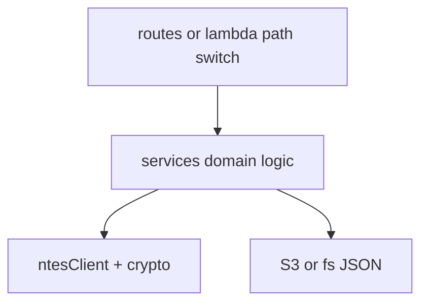

# 13 — Backend Architecture

## Runtimes

| Runtime | Entry | Port / trigger |
|---------|-------|----------------|
| Express PDS | `server.js` | `PORT` \|\| 3000 |
| Express Coach | `coach-position/server.js` | `PORT` \|\| 3001 |
| Lambda API | `lambda/api.js` `handler` | API Gateway HTTP |
| Lambda Refresh | `lambda/refresh.js` `handler` | EventBridge 1 min |

## Layering

## Path routing (Lambda)

`lambda/api.js` inspects `method` + `path` and dispatches:

1. Refresh status/start/stop
2. Health
3. Admin sessions / station / platforms
4. Station lookup
5. Coach displays / board
6. Default → trains board + session touch

## Coach poller embedding

`refresh.js` after writing PDS `live_status.json` calls `refreshCoachStations()` from `coachRefresh.js` when `COACH_BUCKET` is set:

1. Read `station_index.json`
2. Shard stations by minute % `COACH_SHARD_MOD` (default 3 when >10 stations)
3. For each: NTES live board → `buildCoachBoard` → put `board.json` (+ BG legacy aliases)

Coach services are packaged into the PDS zip via `scripts/build-lambda.sh` under `coach-services/` with rewritten `ntesClient` requires.

## Local vs production Coach data path

| | Local `:3001` | Production TV |
|--|---------------|---------------|
| Board | Live NTES on `/api/coach-board` | Static `/data/stations/.../board.json` |
| Save | Local filesystem | PDS Lambda → Coach S3 |
| Ops path | Demo only | CloudFront + API |

## Dedicated Coach Lambda (template)

`coach-position/lambda/*` + `coach-position/infra/template.yaml` describe a standalone stack. **As-built production decision is option B** (reuse PDS Lambdas) because creating new roles/`PassRole` was blocked for the deploy user. Treat dedicated stack as alternate/future unless manually confirmed deployed.

## Error handling

- Catch-all in Lambda returns `503` with `detail` message.
- NTES failures surface as 400/404/502 depending on route.
- S3 access denials on Coach bucket must not be silently treated as empty config (access-error detection in loaders).

## Concurrency

- Sessions and overrides are read-modify-write JSON (last writer wins).
- Suitable for low admin concurrency; not a high-write OLTP design.
