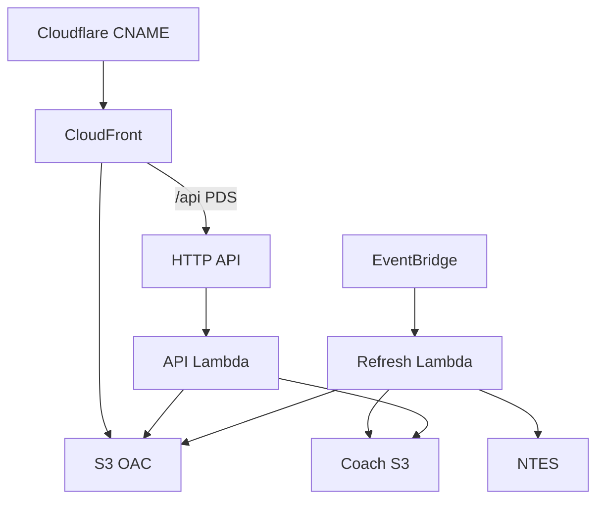

# 23 — Production Hosting Guide

## Target architecture

Serverless AWS (not VPS/PM2). TVs only need outbound HTTPS to CloudFront.

## Hosting components

| Component | Guidance |
|-----------|----------|
| Compute | Lambda Node 22 |
| Static | S3 + CloudFront |
| DNS | Cloudflare grey-cloud CNAME |
| TLS | ACM us-east-1 for CF aliases |
| Schedule | EventBridge 1 minute |
| Process manager | N/A (Lambda) |
| Nginx / VPS | N/A for as-built path |

## URL inventory

| Surface | URL |
|---------|-----|
| PDS display | https://platform.zasya.online |
| PDS admin | https://platform.zasya.online/admin.html |
| PDS health | https://platform.zasya.online/api/health |
| Coach TV | https://coach-position.zasya.online/?station=BG&display=entrance-main |
| Coach Premium TV | https://coach-position.zasya.online/premium.html?station=BG&display=entrance-main |
| Coach chart | https://coach-position.zasya.online/chart.html?station=BG&display=entrance-main |
| Coach admin | https://coach-position.zasya.online/admin.html |
| API direct | https://2j7ifmjjyb.execute-api.ap-south-1.amazonaws.com |
| Coach CF raw | https://d1eozsdsb11ew0.cloudfront.net |

## Deploy steps (summary)

1. Ensure ACM cert validated (Cloudflare validation CNAME).
2. `./scripts/deploy.sh` or update Lambda zip via CLI if IAM CF updates fail.
3. Set `COACH_BUCKET`, `COACH_ADMIN_KEY` on Lambdas.
4. Attach Coach bucket IAM policy to Lambda role (account admin).
5. Publish Coach UI + seed `station_index` / station JSON:
   - UI: `bash coach-position/scripts/publish-ui.sh` (required after HTML/CSS/JS changes; git push does not deploy)
   - Live board data: poller / `publish-live-cache.sh` as applicable
6. Confirm EventBridge rule enabled.
7. Smoke health + TV / Premium / Chart URLs (hard-refresh after CloudFront invalidation).

## Scaling strategy

- Add stations to `station_index.json`; rely on poller sharding.
- Add TVs by opening more URLs — no new servers.
- Raise refresh timeout / shard modulus if NTES loop overruns.
- CloudFront price class India; cache board JSON 30–60s.

## Backup strategy

| Data | Approach |
|------|----------|
| Code | Git |
| Config JSON | S3 versioning (**enable if not on**) — **manual confirmation** |
| Board caches | Rebuildable from NTES |

## Disaster recovery

1. Redeploy Lambda zip from `dist/`.
2. Re-sync `public/` and Coach `public/` + `data/`.
3. Re-create EventBridge rule if missing.
4. Re-point DNS if distribution replaced.

## Deployment checklist

- [ ] ACM ISSUED for custom domains
- [ ] Cloudflare CNAMEs DNS-only
- [ ] Lambda code current (`api` + `refresh`)
- [ ] Env: `BUCKET_NAME`, `ADMIN_KEY`, `COACH_BUCKET`, `COACH_ADMIN_KEY`
- [ ] IAM: CoachBucketAccess on Lambda role
- [ ] API routes for `/api/coach/*` present
- [ ] EventBridge schedule enabled
- [ ] `/api/health` OK
- [ ] Coach `board.json` fresh
- [ ] Admin key works via CloudFront (header forwarding)
- [ ] Backup GH Action not double-writing unintentionally

## Production readiness checklist

- [ ] Secrets rotated from demo defaults
- [ ] Monitoring/alerts defined (ops process)
- [ ] Session stop tested (409 path)
- [ ] Rate card / commercial terms agreed separately
- [ ] NTES failure behaviour accepted by customer
- [ ] No secrets in git
- [ ] Documentation pack reviewed
