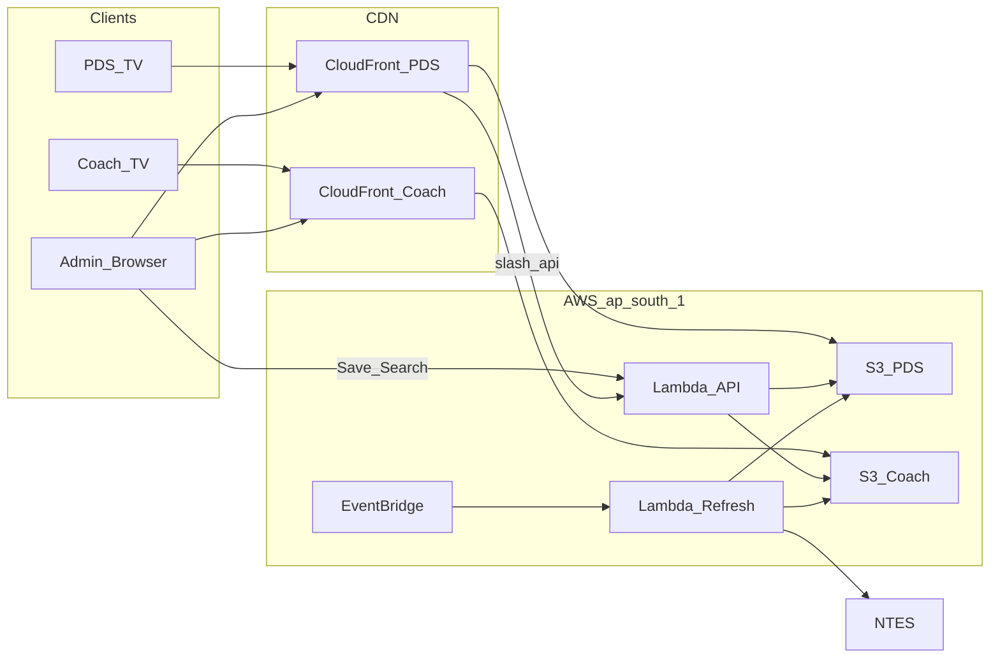

# Diagram — High-level architecture

```mermaid
flowchart LR
  subgraph clients [Clients]
    Pdstv[PDS_TV]
    CoachTv[Coach_TV]
    Admin[Admin_Browser]
  end

  subgraph edge [CDN]
    CfPds[CloudFront_PDS]
    CfCoach[CloudFront_Coach]
  end

  subgraph aws [AWS_ap_south_1]
    Api[Lambda_API]
    Refresh[Lambda_Refresh]
    S3p[S3_PDS]
    S3c[S3_Coach]
    EB[EventBridge]
  end

  NTES[NTES]

  Pdstv --> CfPds
  CoachTv --> CfCoach
  Admin --> CfPds
  Admin --> CfCoach
  Admin -->|Save_Search| Api
  CfPds -->|slash_api| Api
  CfPds --> S3p
  CfCoach --> S3c
  Api --> S3p
  Api --> S3c
  EB --> Refresh
  Refresh --> NTES
  Refresh --> S3p
  Refresh --> S3c
```

Parent: [05 — System Architecture](../05-system-architecture.md)
