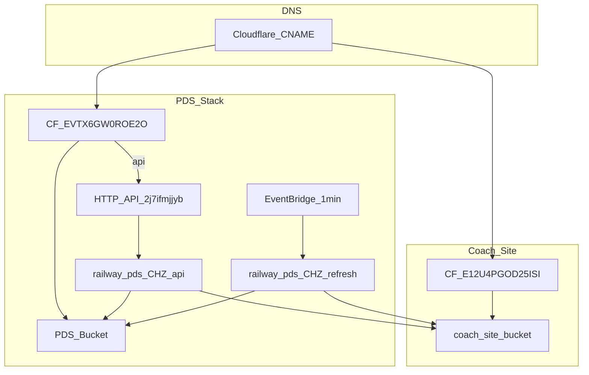

# Diagram — Deployment topology

```mermaid
flowchart TB
  subgraph dns [DNS]
    CF_DNS[Cloudflare_CNAME]
  end

  subgraph pds_stack [PDS_Stack]
    Cf1[CF_EVTX6GW0ROE2O]
    S3a[PDS_Bucket]
    ApiGw[HTTP_API_2j7ifmjjyb]
    Lapi[railway_pds_CHZ_api]
    Lref[railway_pds_CHZ_refresh]
    Rule[EventBridge_1min]
  end

  subgraph coach_site [Coach_Site]
    Cf2[CF_E12U4PGOD25ISI]
    S3b[coach_site_bucket]
  end

  CF_DNS --> Cf1
  CF_DNS --> Cf2
  Cf1 --> S3a
  Cf1 -->|api| ApiGw
  ApiGw --> Lapi
  Rule --> Lref
  Lapi --> S3a
  Lapi --> S3b
  Lref --> S3a
  Lref --> S3b
  Cf2 --> S3b
```

Parent: [23 — Production Hosting](../23-production-hosting-guide.md)
