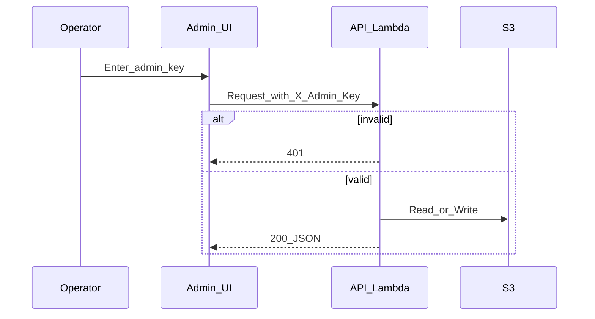

# Diagram — Auth flow (admin key)

```mermaid
sequenceDiagram
  participant Ops as Operator
  participant UI as Admin_UI
  participant API as API_Lambda
  participant S3 as S3

  Ops->>UI: Enter_admin_key
  UI->>API: Request_with_X_Admin_Key
  alt invalid
    API-->>UI: 401
  else valid
    API->>S3: Read_or_Write
    API-->>UI: 200_JSON
  end
```

Parent: [11 — Authentication](../11-authentication-authorization.md)
