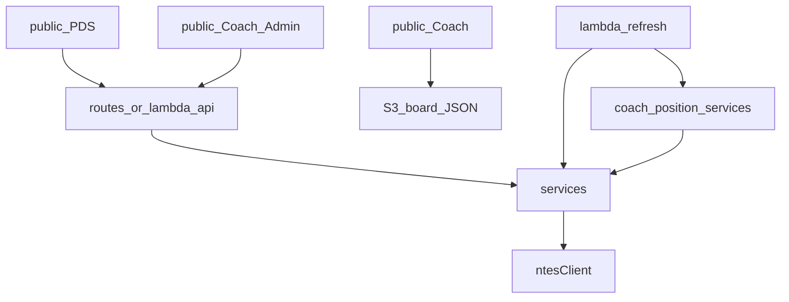

# Diagram — Module dependencies

```mermaid
flowchart TB
  public_pds[public_PDS] --> routes_or_api[routes_or_lambda_api]
  public_coach[public_Coach] --> s3_json[S3_board_JSON]
  public_coach_admin[public_Coach_Admin] --> routes_or_api
  routes_or_api --> services_root[services]
  refresh[lambda_refresh] --> services_root
  refresh --> coach_services[coach_position_services]
  coach_services --> services_root
  services_root --> ntes[ntesClient]
```

Parent: [08 — Module Breakdown](../08-module-breakdown.md)
