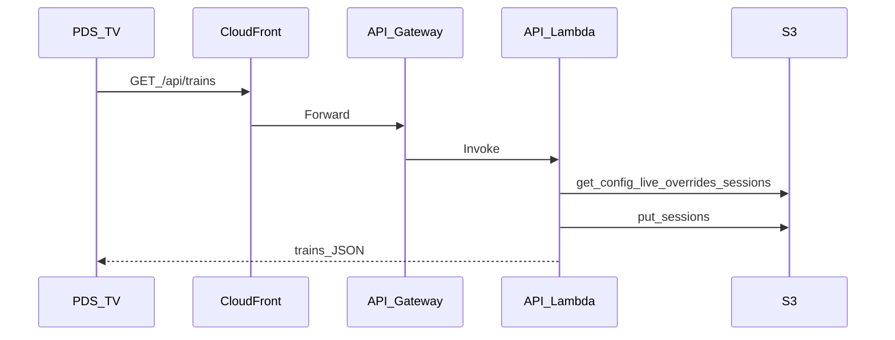

# Diagram — Request lifecycle PDS trains

```mermaid
sequenceDiagram
  participant TV as PDS_TV
  participant CF as CloudFront
  participant GW as API_Gateway
  participant L as API_Lambda
  participant S3 as S3

  TV->>CF: GET_/api/trains
  CF->>GW: Forward
  GW->>L: Invoke
  L->>S3: get_config_live_overrides_sessions
  L->>S3: put_sessions
  L-->>TV: trains_JSON
```

Parent: [05 — System Architecture](../05-system-architecture.md)
