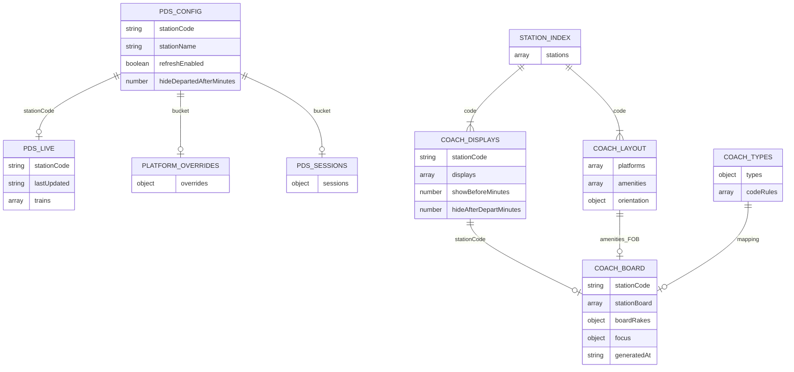

# ERD — JSON data model (logical)

No SQL database. Logical relationships between S3/JSON documents:

```mermaid
erDiagram
  PDS_CONFIG {
    string stationCode
    string stationName
    boolean refreshEnabled
    number hideDepartedAfterMinutes
  }
  PDS_LIVE {
    string stationCode
    string lastUpdated
    array trains
  }
  PLATFORM_OVERRIDES {
    object overrides
  }
  PDS_SESSIONS {
    object sessions
  }
  STATION_INDEX {
    array stations
  }
  COACH_DISPLAYS {
    string stationCode
    array displays
    number showBeforeMinutes
    number hideAfterDepartMinutes
  }
  COACH_LAYOUT {
    array platforms
    array amenities
    object orientation
  }
  COACH_BOARD {
    string stationCode
    array stationBoard
    object boardRakes
    object focus
    string generatedAt
  }
  COACH_TYPES {
    object types
    array codeRules
  }

  PDS_CONFIG ||--o| PDS_LIVE : stationCode
  PDS_CONFIG ||--o| PLATFORM_OVERRIDES : bucket
  PDS_CONFIG ||--o| PDS_SESSIONS : bucket
  STATION_INDEX ||--|{ COACH_DISPLAYS : code
  STATION_INDEX ||--|{ COACH_LAYOUT : code
  COACH_DISPLAYS ||--o| COACH_BOARD : stationCode
  COACH_LAYOUT ||--o| COACH_BOARD : amenities_FOB
  COACH_TYPES ||--o| COACH_BOARD : mapping
```

Parent: [09 — Database Documentation](../09-database-documentation.md)
