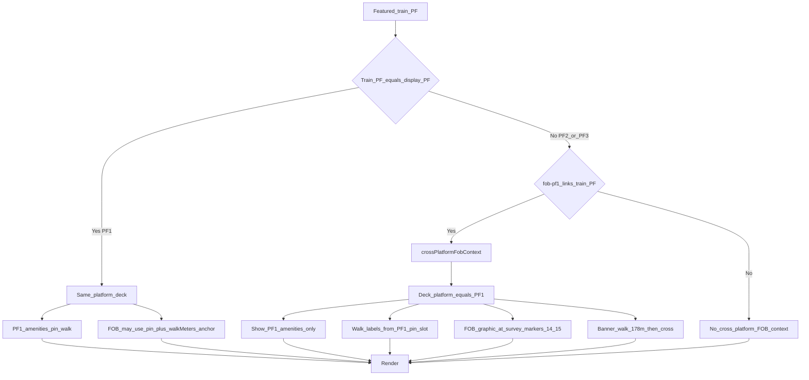

# Workflow — Coach cross-platform wayfinding (BG entrance)

Applies when the TV display pin is on **Platform 1** and the featured train is on **Platform 2 or 3**.

Parent: [06 — Business Logic](../06-business-logic.md)
