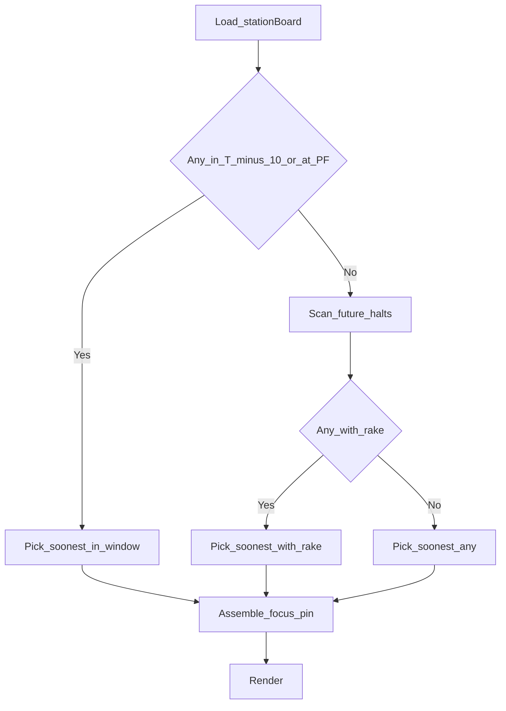

# Workflow — Coach focus selection

```mermaid
flowchart TD
  A[Load_stationBoard] --> B{Any_in_T_minus_10_or_at_PF}
  B -->|Yes| C[Pick_soonest_in_window]
  B -->|No| D[Scan_future_halts]
  D --> E{Any_with_rake}
  E -->|Yes| F[Pick_soonest_with_rake]
  E -->|No| G[Pick_soonest_any]
  C --> H[Assemble_focus_pin]
  F --> H
  G --> H
  H --> I[Render]
```

Parent: [06 — Business Logic](../06-business-logic.md)
