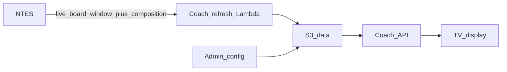

# Coach Position Display — Product Model

Formal product model for the **Coach Position** passenger display. This is a separate application from the Charlapalli / station **PDS arrivals board**.

| | PDS (existing) | Coach Position (this product) |
|---|---|---|
| Public URL | https://platform.zasya.online | https://coach-position.zasya.online |
| Primary UI | Live arrivals / departures table | Horizontal coach rake + “You are here” |
| Timing source | Live NTES station board | Live NTES station board (**window only**) |
| Content source | Board rows | NTES **coach composition** (mapped to type assets) |
| Typical screen | Existing monitors | 65"+ landscape TVs |

Repo placement (implementation phase): sibling app under this monorepo, e.g. `coach-position/` or `apps/coach-position/`, sharing NTES crypto/client patterns from `services/ntesClient.js`. Separate AWS stack so demos never collide with PDS.

---

## What passengers see

- One or two **horizontal** coach strips (engine → guard / configured facing).
- Coach tiles with **icons by type** (engine, pantry, parcel, AC, sleeper, general, etc.).
- Optional **You are here** passenger pin on the platform strip where this TV is mounted, with walk left / right cues.
- Train identity as a **header label** on the strip (number, name, ETA) — not a full arrivals table.

## What is not shown

- The PDS multi-row arrivals board UI.
- Fake coach charts when NTES composition is missing (show unavailable state instead).

---

## Visibility rule (live-board gated)

Coach content appears only while a train is in the **display window** for that platform:

| Condition | Show coach strip? |
|---|---|
| Expected arrival **or** departure within **`showBeforeMinutes`** (default **10**), or train already arrived / at platform | **Yes** |
| Train **departed** and past **`hideAfterDepartMinutes`** (default **15**, same idea as PDS) | **No** — idle / clear strip |
| In window but composition missing | Header + “Coach chart unavailable” (no invented coaches) |
| Multiple trains in window on same PF | Prefer **at-platform**, else **soonest**; V1 shows at most one primary rake per PF (optional secondary “next” label only) |

Config constants (see [fixtures/coach_displays.example.json](fixtures/coach_displays.example.json)):

- `showBeforeMinutes`: `10`
- `hideAfterDepartMinutes`: `15`
- `bogieLengthMeters`: `25` (pin → slot math; tiles are equal width in V1)

---

## Placement scenarios

### Scenario 1 — Entrance display, multiple platforms (`mode: dual`)

- TV at a shared entrance; config lists `platformsShown` (e.g. `["1","2"]`).
- UI: **stacked horizontal rakes** (PF1 above PF2).
- **You are here** only on `youAreHere.platform` (the platform this entrance faces / is configured for).
- Other platform strips show composition without a pin.

### Scenario 2 — One display per platform (`mode: single`)

- TV on (or dedicated to) one platform; `platformsShown` is a single id.
- UI: one full-width horizontal rake + pin for that platform’s mount.
- Separate TVs get separate display profiles (`?display=pf1-mid`, `?display=pf2-entrance`).

### Pin resolution

1. Prefer explicit `youAreHere.slotIndex` if set.
2. Else `round(metersFromEngineEnd / bogieLengthMeters)` clamped to coach count.
3. `facing: engine_left | engine_right` maps physical walk direction to on-screen left/right.

TV boot URL: `https://coach-position.zasya.online/?display=<displayId>`.

---

## Data files (runtime)

| File | Purpose |
|---|---|
| `data/coach_displays.json` | Station defaults + display profiles |
| `data/station_layouts/{code}.json` | Optional platform list / engine-stop notes |
| `data/coach_types.json` | NTES code → asset id / styling |
| `data/coach_board_cache.json` | Refresh output (compositions in window) |
| `public/img/coaches/*` | Tile artwork per `typeId` |

Schemas: [schemas/](schemas/). Examples: [fixtures/](fixtures/).

---

## API sketch

| Method | Path | Role |
|---|---|---|
| `GET` | `/api/coach-board?display={id}` | Platforms in window + coaches + resolved `youAreHere` |
| `GET` | `/api/admin/displays` | List / read config (admin key) |
| `POST` | `/api/admin/displays` | Create / update display profiles |
| Refresh job | (EventBridge + Lambda) | Live board → time filter → composition fetch → S3 cache |

Response shape: [schemas/coach_board_response.schema.json](schemas/coach_board_response.schema.json).

---

## Languages

V1: rotate chrome labels EN → TE → HI (same spirit as PDS). Coach codes (`B1`, `S5`) stay as on the chart; type labels may use i18n later.

---

## Out of scope (this model / V1)

- Production Lambda deploy and live ACM cutover (see [INFRA.md](INFRA.md) for planned steps).
- Final illustrated SVG set (asset **checklist** only in [wireframes.md](wireframes.md)).
- PNR / seat lookup.
- Pixel-perfect metre-scaled coach widths (25 m is for pin math).

---

## Related docs

- [wireframes.md](wireframes.md) — layout ASCII + asset checklist  
- [INFRA.md](INFRA.md) — domain, CloudFront, DNS vs PDS  
- [schemas/](schemas/) — JSON Schema  
- [fixtures/](fixtures/) — example configs and compositions  
