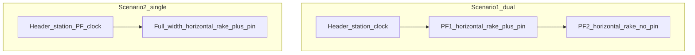

# Coach Position — Wireframes (65"+ landscape)

Horizontal coach tiles only. Dual mode stacks **two horizontal rakes**; it does not stack coaches vertically.



---

## Scenario 1 — Entrance, dual platform

URL example: `/?display=entrance-main`

```text
┌──────────────────────────────────────────────────────────────┐
│ Logo  STATION NAME                    HH:MM:SS / date / lang │
├──────────────────────────────────────────────────────────────┤
│ PLATFORM 1 · 12714 NAME · Arr xx:xx · PF 1                   │
│ [ENG][SLR][S1][S2][PC][B1][B2][A1][HA1][SLR]  →              │
│              ▲ You are here                                  │
│         ← walk left          walk right →                    │
├──────────────────────────────────────────────────────────────┤
│ PLATFORM 2 · 17012 NAME · Arr yy:yy · PF 2                   │
│ [ENG][…][…][…][…][…][…][…]                                   │
│ (no pin)                                                     │
└──────────────────────────────────────────────────────────────┘
```

Notes:

- Long rakes may scroll horizontally within the strip; prefer fitting common rake lengths without scroll on 65".
- Pin aligns under the resolved coach slot; arrows use `facing` so left/right match the platform walk.

---

## Scenario 2 — Single platform display

URL example: `/?display=pf2-mid`

```text
┌──────────────────────────────────────────────────────────────┐
│ Logo  STATION · PLATFORM 2            HH:MM:SS               │
├──────────────────────────────────────────────────────────────┤
│ 12714 NAME · Arr xx:xx                                       │
│                                                              │
│ [ENG][SLR][S1]…[B1]…[A1][SLR]   (large tiles, full width)    │
│              ▲ You are here                                  │
│         ← left                 right →                       │
└──────────────────────────────────────────────────────────────┘
```

---

## Idle / outside window

```text
┌──────────────────────────────────────────────────────────────┐
│ Logo  STATION NAME                         HH:MM:SS          │
├──────────────────────────────────────────────────────────────┤
│                                                              │
│          No train in coach-display window                    │
│          Next: 17229 Sabari Exp · PF 2 · in 42 min           │
│                                                              │
└──────────────────────────────────────────────────────────────┘
```

---

## Composition unavailable (in window)

```text
│ PLATFORM 1 · 18045 East Coast · Arr 08:40 · PF 6             │
│                                                              │
│          Coach chart unavailable                             │
│          (NTES composition not returned)                     │
```

---

## Admin (same host `/admin.html`)

```text
┌──────────────────────────────────────────────────────────────┐
│ Coach Position Admin                                         │
├──────────────────────────────────────────────────────────────┤
│ Displays                                                     │
│  [entrance-main] dual  PF1+PF2  pin→PF1 @ 75m   [Edit]       │
│  [pf2-mid]       single PF2     pin→PF2 @ 50m   [Edit]       │
│                                                              │
│ Edit display                                                 │
│  id / name / mode / platforms                                │
│  youAreHere: platform · metres or slot · facing              │
│  [Preview mock rake with pin]                                │
└──────────────────────────────────────────────────────────────┘
```

---

## Coach-type asset checklist

Place final art under app `public/img/coaches/` (filenames match `asset` in [fixtures/coach_types.example.json](fixtures/coach_types.example.json)).

| typeId | Suggested file | Visual brief |
|---|---|---|
| `engine` | `engine.svg` | Dark locomotive silhouette |
| `slr` | `slr.svg` | Luggage / SLR |
| `parcel` | `parcel.svg` | Parcel van |
| `pantry` | `pantry.svg` | Pantry car |
| `ac1` | `ac1.svg` | Blue AC + 1A |
| `ac2` | `ac2.svg` | Blue AC + 2A |
| `ac3` | `ac3.svg` | Blue AC + 3A/3E |
| `chair` | `chair.svg` | Chair / CC / EC |
| `sleeper` | `sleeper.svg` | Green sleeper |
| `general` | `general.svg` | Grey GS / GEN |
| `eog` | `eog.svg` | Generator / EOG |
| `unknown` | `unknown.svg` | Neutral coach shell |

Tile chrome (V1):

- Equal width tiles; label = coach `code` (e.g. `B1`).
- Colour family from `coach_types.json` `color`.
- Motion: rake slide-in on load; soft pulse on You-are-here pin.

Placeholder note: until art is delivered, CSS-coloured rectangles + text labels are acceptable for mocks.

---

## Motion (display)

1. Enter window → fetch composition → horizontal slide-in of tiles.  
2. Pin appears on configured PF only.  
3. Leave window → fade to idle.  
4. Language chrome rotates slower than PDS (e.g. 15–20s) to reduce flicker on large TVs.
